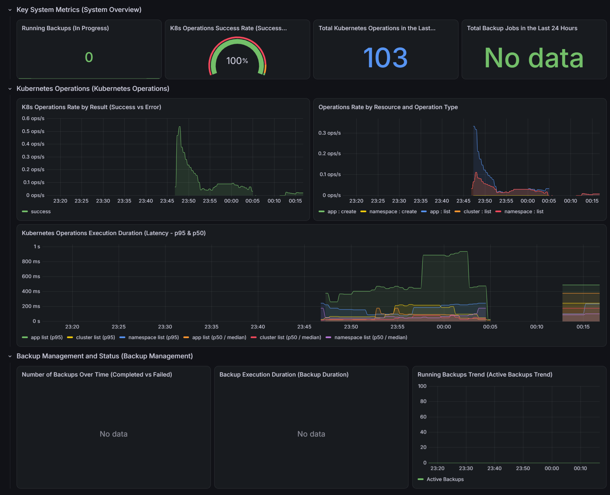

# Kubernetes Infrastructure Monitoring Stack

This repository contains the deployment manifests, configurations, and observability definitions for monitoring a Kubernetes cluster and its underlying services using the VictoriaMetrics ecosystem and Grafana.

---

## Overview

The stack is designed to scrape, aggregate, and visualize operational metrics from cluster workloads and backend API services. While lightweight interfaces like VictoriaMetrics UI (vmui) were initially evaluated, Grafana was adopted as the primary visualization platform to support production-grade, multi-dimensional dashboards and granular telemetry analysis.

---

## Architecture and Components

The observability pipeline consists of the following components:

- **VictoriaMetrics Core:**
  - `vm-operator`: Manages the lifecycle and configuration of VictoriaMetrics components.
  - `vmsingle`: Serves as the central time-series database (TSDB) for metric storage.
  - `vmagent`: Scrapes metric targets across cluster namespaces and forwards data to the TSDB.
  - `vmauth`: Handles routing and authentication proxying for VictoriaMetrics endpoints.

- **Collectors and Exporters:**
  - `kube-state-metrics`: Monitors the health, availability, and state of Kubernetes objects.
  - `node-exporter`: Exposes hardware- and kernel-level metrics from cluster nodes.

- **Visualization:**
  - `Grafana`: Visualizes application performance, operational throughput, error rates, and cluster resource utilization.

---

## Service Endpoints and Access

Access credentials for authenticated endpoints are managed securely and provided separately upon request.

- **Grafana Web Console:**  
  [http://soleimani.osdl.ir/grafana](http://soleimani.osdl.ir/grafana)

- **Dedicated Operations Dashboard:**  
  [Hamamooz Operations Dashboard](http://soleimani.osdl.ir/grafana/d/hamamooz-ops-dashboard/)

- **Application Prometheus Metrics Endpoint:**  
  [http://api.soleimani.osdl.ir/metrics](http://api.soleimani.osdl.ir/metrics)

---

## Telemetry and Metrics Coverage

### 1. Kubernetes Operations Tracking
The backend API exposes custom Prometheus metrics tracking management actions (such as application creation/listing, namespace provisioning, and cluster listings):
- **Throughput:** Real-time request rate measured in operations per second (`ops/s`).
- **Success vs. Error Rates:** Success rates tracked with visual threshold indicators.
- **Latency Distribution:** Execution duration tracked via statistical percentiles (p50 and p95).

### 2. Backup Management Status
The application architecture relies on Celery workers to handle asynchronous backup tasks. Because the Celery worker service is not enabled in the current deployment release, backup jobs are not actively executing, and their corresponding dashboard panels currently reflect a `No data` state.

---

## Dashboard Preview

*Figure: Grafana dashboard tracking request rates, latency percentiles (p50/p95), and operation counts.*

---

## Related Repositories

- **Backend Application Source:**  
  [AH-S-K/kubernetes-manager](https://github.com/AH-S-K/kubernetes-manager)
