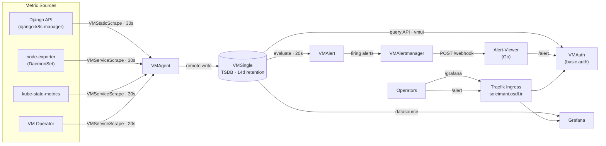

# Kubernetes Infrastructure Monitoring Stack

This repository contains the deployment manifests, configurations, and observability definitions for monitoring a Kubernetes cluster and its underlying services using the VictoriaMetrics ecosystem and Grafana. It covers metric collection, storage, visualization, and alerting.

---

## Overview

The stack scrapes, aggregates, and visualizes operational metrics from cluster workloads, node-level resources, and backend API services. VictoriaMetrics UI (vmui) was initially evaluated as the visualization layer; Grafana was adopted instead, as it supports multi-dimensional dashboards and longer-range telemetry analysis.

All components are deployed into a dedicated `monitoring-system` namespace on a k3s cluster. The VictoriaMetrics Operator reconciles the custom resources (`VMSingle`, `VMAgent`, `VMAuth`, `VMAlert`, `VMAlertmanager`, `VMRule`, `VMServiceScrape`, `VMStaticScrape`) into the underlying workloads, so configuration is expressed as declarative specs rather than hand-written Deployments. Every component defines explicit CPU and memory requests and limits.

---

## Architecture and Components



The pipeline consists of the following components:

- **VictoriaMetrics Core:**
  - `vm-operator`: Manages the lifecycle and configuration of VictoriaMetrics components. Installed from the `vm` Helm chart with the resource values recorded in `cookbook.md`.
  - `vmsingle`: Central time-series database (TSDB), 14-day retention, 4Gi volume on the `local-path` storage class.
  - `vmagent`: Scrapes the targets described by `VMServiceScrape` and `VMStaticScrape` objects in all namespaces — both the ones defined in this repository and the ones the operator generates for the VictoriaMetrics components — and remote-writes the samples to `vmsingle`.
  - `vmauth`: Authentication and path-based routing proxy in front of the VictoriaMetrics query API and the alert feed.

- **Collectors and Exporters:**
  - `kube-state-metrics`: Reports the state of Kubernetes objects.
  - `node-exporter`: Exposes host- and kernel-level metrics from cluster nodes.

- **Alerting:**
  - `vmalert`: Evaluates alerting rules against the TSDB at a fixed interval.
  - `vmalertmanager`: Groups and routes firing alerts to the configured receiver.
  - `alert-viewer`: Go webhook server that keeps received alerts in memory and serves them as an HTML page.

- **Visualization:**
  - `Grafana`: Dashboards for application throughput, error rates, latency, and cluster resource usage.

---

## Repository Structure

```
monitoring-system/
├── README.md
├── Hamamooz-K8s-&-Backup-Operations.png
└── k8s-manifests/
    ├── 0.secrets.example.yaml
    ├── 1-vmsingle.yaml
    ├── 2-vmagent.yaml
    ├── 3-node-exporter.yaml
    ├── 4-django-vmscrape.yaml
    ├── 5-vmauth-security.yaml
    ├── 6-kube-state-metrics.yaml
    ├── 7-grafana.yaml
    ├── 8-ingress.yaml
    ├── 9-vm-scrapes.yaml
    ├── 10-vmalert.yaml
    ├── 11-alertmanager.yaml
    ├── 12-vmrule.yaml
    ├── 13-alert-viewer.yaml
    └── cookbook.md
```

| Manifest | Resources | Responsibility |
| --- | --- | --- |
| `0.secrets.example.yaml` | `Secret` (template) | Template for the credentials consumed by Grafana and VMAuth. |
| `1-vmsingle.yaml` | `VMSingle` | TSDB, retention, storage and resource settings. |
| `2-vmagent.yaml` | `VMAgent` | Scrape orchestration and remote write to `vmsingle`. |
| `3-node-exporter.yaml` | `DaemonSet`, `Service`, `VMServiceScrape` | Host-level metrics, collector flags, and node-aware relabeling. |
| `4-django-vmscrape.yaml` | `VMStaticScrape` | Static scrape target for the Django backend `/metrics` endpoint. |
| `5-vmauth-security.yaml` | `VMUser`, `VMAuth` | Basic-auth gateway and path routing to the alert feed and the query API. |
| `6-kube-state-metrics.yaml` | `ServiceAccount`, `ClusterRole`, `ClusterRoleBinding`, `Deployment`, `Service`, `VMServiceScrape` | Kubernetes object state metrics with a read-only RBAC policy. |
| `7-grafana.yaml` | `PersistentVolumeClaim`, `Deployment`, `Service` | Grafana served from the `/grafana` sub-path. |
| `8-ingress.yaml` | `Ingress` | Traefik routing rules for Grafana and the alert path. |
| `9-vm-scrapes.yaml` | `VMServiceScrape` | Scrape configuration for the VictoriaMetrics Operator metrics endpoint. |
| `10-vmalert.yaml` | `VMAlert` | Rule evaluation against the TSDB, with notifier and external labels. |
| `11-alertmanager.yaml` | `Secret`, `VMAlertmanager` | Alert routing configuration and notification dispatch. |
| `12-vmrule.yaml` | `VMRule` | Alerting rule definitions for the Django API target. |
| `13-alert-viewer.yaml` | `ConfigMap`, `Deployment`, `Service` | Go source, in-cluster build, and runtime of the alert-viewer webhook server. |

---

## Deployment Procedure

The ordered command sequence is maintained in [`k8s-manifests/cookbook.md`](k8s-manifests/cookbook.md). The `kubectl apply` commands below are executed from within the `k8s-manifests/` directory.

**Prerequisites**

- A reachable k3s cluster with `kubectl` configured (`export KUBECONFIG=/etc/rancher/k3s/k3s.yaml`).
- Helm 3, used to install the VictoriaMetrics Operator from the `vm` chart repository.
- The default k3s building blocks: Traefik ingress controller and the `local-path` storage provisioner.
- Outbound network access for image pulls and for the Go build performed by the alert-viewer init container. The build does not write to the image filesystem: `GOCACHE` and `GOTMPDIR` point into an `emptyDir` volume.

**Bootstrap the control plane**

```bash
kubectl create namespace monitoring-system

helm repo add vm https://victoriametrics.github.io/helm-charts/
helm repo update

helm upgrade --install vm-operator vm/victoria-metrics-operator \
  --namespace monitoring-system \
  --create-namespace \
  --qps 1 \
  --burst-limit 3 \
  --set operator.resources.requests.cpu=10m \
  --set operator.resources.requests.memory=40Mi \
  --set operator.resources.limits.cpu=250m \
  --set operator.resources.limits.memory=128Mi
```

**Provision the credentials**

```bash
cp 0.secrets.example.yaml 0.secrets.yaml   # populate real values; do not commit this file
kubectl apply -f 0.secrets.yaml
```

**Apply the manifests in order**

The numbering encodes the dependency order: storage first, then the collector plane, scrape configuration, the authentication gateway, cluster-state exporters, visualization, ingress, operator self-monitoring, and finally the alerting pipeline.

```bash
kubectl apply -f 1-vmsingle.yaml
kubectl apply -f 2-vmagent.yaml
kubectl apply -f 3-node-exporter.yaml
kubectl apply -f 4-django-vmscrape.yaml
kubectl apply -f 5-vmauth-security.yaml
kubectl apply -f 6-kube-state-metrics.yaml
kubectl apply -f 7-grafana.yaml
kubectl apply -f 8-ingress.yaml
kubectl apply -f 9-vm-scrapes.yaml
kubectl apply -f 10-vmalert.yaml
kubectl apply -f 11-alertmanager.yaml
kubectl apply -f 12-vmrule.yaml
kubectl apply -f 13-alert-viewer.yaml
```

**Post-deployment verification**

```bash
kubectl -n monitoring-system get pods,svc
kubectl -n monitoring-system get vmsingle,vmagent,vmauth,vmalert,vmalertmanager
kubectl -n monitoring-system port-forward svc/vmauth-vmauth-gateway 8427:8427   # vmui at http://localhost:8427/vmui/
```

---

## Service Endpoints and Access

Access credentials for authenticated endpoints are managed separately and provided upon request.

- **Grafana Web Console:**  
  [http://soleimani.osdl.ir/grafana](http://soleimani.osdl.ir/grafana)

- **Dedicated Operations Dashboard:**  
  [Hamamooz Operations Dashboard](http://soleimani.osdl.ir/grafana/d/hamamooz-ops-dashboard/)

- **Alert Feed (Alert-Viewer via VMAuth):**  
  [http://soleimani.osdl.ir/alert](http://soleimani.osdl.ir/alert)

- **Application Prometheus Metrics Endpoint:**  
  [http://api.soleimani.osdl.ir/metrics](http://api.soleimani.osdl.ir/metrics)

Only the `/grafana` and `/alert` paths are published through the Traefik ingress. The VictoriaMetrics query API, `vmui`, and the TSDB are not exposed externally and are reachable through the VMAuth gateway (for example, via `port-forward` as shown above).

---

## Alerting Pipeline

Alerting consists of four stages, each deployed from its own manifest:

1. **Rule definition (`VMRule`)** — alert expressions are declared as operator custom resources and selected by `vmalert` through `selectAllByDefault`.
2. **Evaluation (`VMAlert`)** — rules are evaluated every `20s` against `vmsingle`; the external labels `cluster: soleimani-ha` and `env: production` are attached to the emitted alerts.
3. **Routing (`VMAlertmanager`)** — the configuration secret groups alerts by `alertname` and `job` (`group_wait: 5s`, `group_interval: 10s`, `repeat_interval: 1m`) and sends them to a single webhook receiver.
4. **Presentation (`Alert-Viewer`)** — the webhook payload is parsed, non-firing alerts are dropped, and the remaining entries are prepended to an in-memory list that is rendered as an HTML page.

The shipped rule, `DjangoApiAlwaysFiring`, is an always-firing expression (`up{app="django-api",job="django-api"} == 1`, `for: 0s`). It fires on every evaluation in which the Django target is reported up, which exercises the whole path from rule evaluation to page rendering. Substituting threshold-based rules requires no change to the other three stages.

**Alert-Viewer behaviour**

- Keeps the 60 most recent entries, newest first; entries beyond the cap are dropped.
- Records firing alerts only. The per-alert `status` is used, falling back to the payload-level `status` when it is empty; the alertmanager is also configured with `send_resolved: false`.
- Each entry is stamped with the ingest time in UTC and, when available, the alert start time formatted as `HH:MM:SS UTC`.
- Routes: `/webhook` (POST ingest), `/alert` and `/` (HTML page), `/healthz` (readiness and liveness probe target). Non-POST requests to `/webhook` return `405`; payloads that exceed the size limit or fail to decode return `400`.
- The page reloads every 10 seconds through a meta refresh tag. Alert text is HTML-escaped and long values wrap.
- Response headers on the page: `Content-Security-Policy: default-src 'none'; style-src 'unsafe-inline'; base-uri 'none'; frame-ancestors 'none'`, `X-Frame-Options: DENY`, `X-Content-Type-Options: nosniff`, `Referrer-Policy: no-referrer`.
- On `SIGINT` or `SIGTERM` the server stops accepting new connections and shuts down with a 5-second timeout.
- Alerts are stored in memory only; the list is empty after a pod restart.

---

## Security and Access Control

- **Credentials:** usernames and passwords are held in the `monitoring-secrets` Secret and referenced through `secretKeyRef` and `passwordRef`. Only the placeholder template `0.secrets.example.yaml` is version-controlled.
- **Authenticated gateway:** VMAuth requires HTTP basic authentication for every proxied path. In the `VMUser` definition, `^/alert.*` (static target: alert-viewer) is listed before the VMSingle patterns (`/api/v1/.*`, `/vmui.*`, `/prometheus/.*`, `^/$`).
- **RBAC:** the `kube-state-metrics` ClusterRole grants only `list` and `watch` on an enumerated set of resources. No component in this stack requests write access, and none requests access to Secrets through RBAC.
- **Alert-viewer pod security:** at pod level, `automountServiceAccountToken: false`, `fsGroup: 65534`, and `seccompProfile: RuntimeDefault`. Both the init container and the runtime container set `runAsNonRoot: true`, `runAsUser`/`runAsGroup: 65534`, `readOnlyRootFilesystem: true`, `allowPrivilegeEscalation: false`, and `capabilities.drop: ["ALL"]`.
- **Request handling:** webhook bodies are limited to 512 KiB with `http.MaxBytesReader` and closed via `defer`. The HTTP server sets `ReadHeaderTimeout: 5s`, `ReadTimeout: 10s`, `WriteTimeout: 10s`, and `IdleTimeout: 15s`.
- **Response headers:** the alert page is served with a restrictive Content-Security-Policy and with framing, MIME sniffing, and referrer leakage disabled, so alert annotations cannot execute script or embed the page in a frame.
- **In-cluster build:** the binary is compiled at pod startup by an init container from the `alert-viewer-source` ConfigMap (`CGO_ENABLED=0`, `-ldflags='-s -w'`), so no external build pipeline or image registry is involved. `GOCACHE` and `GOTMPDIR` point into the `tmp-dir` volume, and the build command removes `/tmp/.cache` and the remaining contents of `/tmp` after compiling. The runtime image is `alpine:3.20`.
- **Volume size limits:** `app-bin` and `tmp-dir` are `emptyDir` volumes with `sizeLimit: 100Mi` and `sizeLimit: 500Mi` respectively.
- **Network exposure:** all Services are `ClusterIP`, and the ingress publishes only `/grafana` and `/alert` on host `soleimani.osdl.ir`. Grafana runs with self-service sign-up, usage reporting, and update checks disabled.

---

## Telemetry and Metrics Coverage

### 1. Kubernetes Operations Tracking
The backend API exposes custom Prometheus metrics tracking management actions (such as application creation/listing, namespace provisioning, and cluster listings):
- **Throughput:** Real-time request rate measured in operations per second (`ops/s`).
- **Success vs. Error Rates:** Success rates tracked with visual threshold indicators.
- **Latency Distribution:** Execution duration tracked via statistical percentiles (p50 and p95).

### 2. Cluster and Node Infrastructure
- **Kubernetes object state:** `kube-state-metrics` reports on namespaces, nodes, pods, persistent volume claims, resource quotas, services, deployments, statefulsets, daemonsets, and ingresses. The `uid`, `container_id`, and `image_id` labels are dropped at scrape time, and each series is relabeled with `cluster="soleimani-ha"`.
- **Host-level telemetry:** `node-exporter` runs as a DaemonSet with `hostNetwork` and `hostPID`, and tolerates all taints so that every node is covered. The `wifi`, `hwmon`, and `zfs` collectors are disabled, and filesystem mount points and types are filtered to exclude k3s, kubelet, and container-runtime paths. Relabeling maps the pod's node name to both `instance` and `nodename`.
- **Operator self-monitoring:** the VictoriaMetrics Operator metrics endpoint is scraped every 20 seconds on `targetPort: 8080`.

### 3. Backup Management Status
The application architecture relies on Celery workers to handle asynchronous backup tasks. Because the Celery worker service is not enabled in the current deployment release, backup jobs are not actively executing, and their corresponding dashboard panels currently reflect a `No data` state. A `celery-scrape` `VMServiceScrape` object exists in the cluster for this purpose, but it collects no samples while the worker service is absent.

### 4. VictoriaMetrics Self-Monitoring
- **Operator:** `9-vm-scrapes.yaml` defines a `VMServiceScrape` for the operator's own `/metrics` endpoint on `targetPort: 8080`, scraped every 20 seconds.
- **VictoriaMetrics components:** the operator generates one `VMServiceScrape` per VictoriaMetrics CR it manages. The scrapes for `vmsingle`, `vmagent`, `vmauth`, `vmalert`, and `vmalertmanager` therefore exist in the namespace without a corresponding manifest file in this repository, and they are the data source for the VictoriaMetrics component dashboards in Grafana.

---

## Scrape Objects in the Cluster

The scrape configuration resolved by `vmagent` in the `monitoring-system` namespace consists of the following objects, all reported as `operational`:

| Object | Kind | Defined by |
| --- | --- | --- |
| `django-scrape` | `VMStaticScrape` | `4-django-vmscrape.yaml` |
| `node-exporter-scrape` | `VMServiceScrape` | `3-node-exporter.yaml` |
| `kube-state-metrics-scrape` | `VMServiceScrape` | `6-kube-state-metrics.yaml` |
| `vmoperator-scrape` | `VMServiceScrape` | `9-vm-scrapes.yaml` |
| `vmsingle-vm-backend` | `VMServiceScrape` | generated by the operator from the `VMSingle` CR |
| `vmagent-vmagent` | `VMServiceScrape` | generated by the operator from the `VMAgent` CR |
| `vmauth-vmauth-gateway` | `VMServiceScrape` | generated by the operator from the `VMAuth` CR |
| `vmalert-vmalert` | `VMServiceScrape` | generated by the operator from the `VMAlert` CR |
| `vmalertmanager-alertmanager` | `VMServiceScrape` | generated by the operator from the `VMAlertmanager` CR |
| `celery-scrape` | `VMServiceScrape` | not tracked in this repository |

`vmagent` selects all of them because it is deployed with `selectAllByDefault: true` and an empty `serviceScrapeNamespaceSelector`.

---

## Grafana Dashboards

Dashboards are imported through the Grafana UI; this repository contains neither provisioning files nor dashboard JSON, so the definitions live only in Grafana's persistent volume.

| Dashboard | Folder | Primary metric source |
| --- | --- | --- |
| Hamamooz Operations Dashboard | — | `django-scrape` |
| VictoriaMetrics | — | VictoriaMetrics component scrapes |
| VictoriaMetrics - Alert statistics | — | `vmalert-vmalert`, `vmalertmanager-alertmanager` |
| VictoriaMetrics - operator | `victoriametrics` | `vmoperator-scrape` |
| VictoriaMetrics - single-node | `victoriametrics` | `vmsingle-vm-backend` |
| VictoriaMetrics - vmagent | `victoriametrics` | `vmagent-vmagent` |
| VictoriaMetrics - vmalert | `victoriametrics` | `vmalert-vmalert` |
| VictoriaMetrics - vmauth | `victoriametrics` | `vmauth-vmauth-gateway` |

The `VictoriaMetrics - *` dashboards are the ones published by the VictoriaMetrics project; the entries grouped under the `victoriametrics` folder are the per-component views, and those shown without a folder appear at the top level of the Grafana dashboard list. The operations dashboard is reachable at [http://soleimani.osdl.ir/grafana/d/hamamooz-ops-dashboard/](http://soleimani.osdl.ir/grafana/d/hamamooz-ops-dashboard/).

---

## Configuration Reference

| Parameter | Value | Location |
| --- | --- | --- |
| Namespace | `monitoring-system` | All manifests |
| Metric retention | `14d` | `1-vmsingle.yaml` |
| TSDB storage | `4Gi` on `local-path` | `1-vmsingle.yaml` |
| Grafana storage | `1Gi` on `local-path` | `7-grafana.yaml` |
| Stateful node pinning | `kubernetes.io/hostname: soleimani-ha2` | `1-vmsingle.yaml`, `7-grafana.yaml` |
| Global scrape interval | `30s` | `2-vmagent.yaml` |
| Operator scrape interval | `20s` | `9-vm-scrapes.yaml` |
| Alert evaluation interval | `20s` | `10-vmalert.yaml` |
| Alert grouping / repeat | `5s` / `10s` / `1m` | `11-alertmanager.yaml` |
| External labels | `cluster=soleimani-ha`, `env=production` | `10-vmalert.yaml` |
| Alert list depth | `60` entries | `13-alert-viewer.yaml` |
| Alert page refresh | `10s` | `13-alert-viewer.yaml` |
| Webhook body limit | `512 KiB` | `13-alert-viewer.yaml` |
| Shutdown timeout | `5s` | `13-alert-viewer.yaml` |
| Init container resources | requests `1000m` / `128Mi`, limits `2000m` / `512Mi` | `13-alert-viewer.yaml` |
| Server container resources | requests `10m` / `16Mi`, limits `50m` / `32Mi` | `13-alert-viewer.yaml` |
| `app-bin` volume | `emptyDir`, `sizeLimit: 100Mi` | `13-alert-viewer.yaml` |
| `tmp-dir` volume | `emptyDir`, `sizeLimit: 500Mi` | `13-alert-viewer.yaml` |
| Ingress class / entrypoint | `traefik` / `web` | `8-ingress.yaml` |
| Public hostname | `soleimani.osdl.ir` | `7-grafana.yaml`, `8-ingress.yaml` |

Pinned image versions: `grafana/grafana:13.2.1`, `prom/node-exporter:v1.10.2`, `registry.k8s.io/kube-state-metrics/kube-state-metrics:v2.19.0`, `golang:1.27.1-alpine3.24`, `alpine:3.20`.

---

## Dashboard Preview


*Figure: Grafana dashboard tracking request rates, latency percentiles (p50/p95), and operation counts.*

---

## Operational Notes

- **Storage locality:** `local-path` volumes are bound to the node on which they are provisioned, which is why `vmsingle` and `grafana` carry a `nodeSelector` for `soleimani-ha2`. Moving these workloads to another node requires re-provisioning their volumes.
- **Grafana state:** Grafana persists its data on the PVC, so dashboards, users, and datasource definitions survive restarts. Nothing is provisioned declaratively: the VictoriaMetrics datasource and every dashboard listed in [Grafana Dashboards](#grafana-dashboards) exist only inside that volume, so a fresh deployment or a lost volume requires re-importing them by hand. Exporting the dashboard JSON from the Grafana UI keeps a copy outside the cluster.
- **Operator-generated scrape objects:** the `VMServiceScrape` objects for the VictoriaMetrics components are created by the operator from their CRs and are not stored in this repository. Deleting a CR also removes its scrape object.
- **Alert list persistence:** the alert-viewer list is in-memory. Termination drains in-flight requests within 5 seconds, but the list is not stored anywhere; with `repeat_interval: 1m` it refills within about a minute of the pod becoming ready.
- **Build cost and scheduling:** the init container compiles the binary on every pod start. Kubernetes derives a pod's effective resource request from the maximum of its init-container and container requests, so the alert-viewer pod holds a `1000m` CPU and `128Mi` memory request for its whole lifetime and only schedules on a node with that much allocatable CPU free. The `golang:1.27.1-alpine3.24` image must be pullable by the node.
- **Transport security:** the ingress is bound to the `web` (HTTP) entrypoint. TLS termination is handled outside this stack.
- **Secret hygiene:** the populated `0.secrets.yaml` is generated locally from the example template and should remain untracked; adding it to `.gitignore` is recommended for forks or downstream copies of this repository.

---

## Related Repositories

- **Backend Application Source:**  
  [AH-S-K/kubernetes-manager](https://github.com/AH-S-K/kubernetes-manager)
